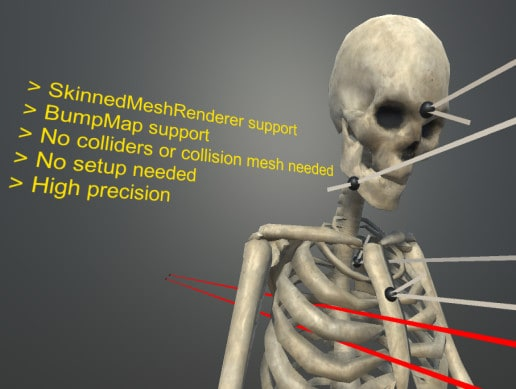

# Super Raycast (Free Source Code!)



The source code for [Super Raycast](https://assetstore.unity.com/packages/tools/physics/super-raycast-91154) asset.

Unity doesn't run well on my Linux, and nobody buys the asset any more, so have it for free!

WARNING: Layer 31 is used for processing stuff. Please don't use this layer for objects.

# About

Super Raycast can give you pixel perfect ray casting against up to 10,000 Renderers at a time.

No complex setup required. It works like Physics.Raycast. Simply call:
`SuperRaycast.Raycast()`

A typical setup:

```cs
RaycastHitRenderer hitInfo;
if (SuperRaycast.Raycast(ray, gameObject, out hitInfo))
{
	// The GameObject was hit!

	// The hitInfo contains these properties, among others.
	hitInfo.point;	// The point of contact.
	hitInfo.normal;	// The normal of the collision point.
	hitInfo.color;	// The color of the object at that point based on it's _MainTex.
	hitInfo.uv;		// The UV of the contact point.

	hitInfo.data;	// This is contextual. Could be Vertex Color or UV data (channel 0, 1).
}

SuperRaycast.USE_BUMPMAP = true;	// Enable/disable higher quality bump maps by using the objects normal map texture.
SuperRaycast.USE_HEIGHTMAP = true;	// Enable/disable higher quality height maps by using the objects height map texture.
SuperRaycast.HEIGHTMAP_SCALE = .01f;// The scale used when reading height map textures.

/*(disabled as of 1.3)*/ SuperRaycast.OPENGL = false;		// If things aren't working try toggling this on/off.

// Some resources are pooled in the background to make things faster. You can clear them all with this.
SuperRaycast.CleanUp();
```

# Known issues

Raycast wont work properly if called in OnDrawGizmos.

# Changes

## 1.4
- Greatly improved hit point accuracy at far distances by:
	- Using EncodeFloatRGBA, so 4 channels are used to calculate distance instead of 1.
	- Testing is done from Renderer boundary point instead of Ray origin, if it is closer.
- Removed ImproveAccuracy method, as it shouldn't be necessary any more.
- SuperRaycastCamera tweaks.
	- Clamped movement speed so you don't fly off into stratosphere.
	- defaultPivotDistance = pivot point distance when rotating the camera without having anything selected.
- SuperRaycast.Raycast(Renderer[]) reduced 2 for-loops to 1.

## 1.3.1
- Fixed incorrect layer mask bitwise math.
- Max distance culling is based on hitpoint now, not Renderer bounds.
- Fixed problem where Raycast ignored maxDistance if only testing against one Renderer.

## 1.3
- Removed the OPENGL feature to keep things simple.
- Modified Raycast() paramaters so it's less confusing. No hitInfo is returned, and you can pass in a maxDistance and layerMask.
- Added GetRenderers(layerMask) to retrieve a list of renderers by for a specific layer.
- SuperRaycastCamera tweaks.
	- Pivot point only set if ray collides with an object.
	- Zoom is based on direction to pivot point.
	- Zoom speed is clamped, so it's easier to move through objects.
	- You can override how UpdateRendererList works by setting GetRenderersFunc to any method that returns Renderer[].

## 1.2
- Added SuperRaycastCamera. Useful for runtime editors.
- Works with tiled/offset textures now.
- RaycastHitRenderer now uses _Parallax property if USE_HEIGHTMAP is enabled and the material has a _ParallaxMap.
- Ignores mipmaps/filter mode of the textures for crisper results.
- Fixed bug that prevented normal data coming back when USE_BUMPMAP = false.
- Fixed Raycast(Renderer[]) returning an uncorrected hit point.
- Fixed hit point error when USE_HEIGHTMAP == true but the material has no _ParallaxMap.
- Various shortcut fields added to RaycastHitRenderer. (gameObject, root, rootGameObject.)

## 1.1
- Added heightmap support.
- Bumpmap scale is now taken into account (if USE_BUMPMAP is enabled).
- Multi Renderer testing can now test against up to 10,000 rather than 1,079. (It would be trivial to increase it more.)
- Improved DX11 compatability.
- Fixed some null reference errors.
- Fixed material property reset problem that occured when running SuperRaycast in editor after the user saved/serialized the current scene.

## 1.0
- Raycast(ray, Renderer[]) will call Raycast(ray, Renderer) to improve accuracy.
- Added EditorCameraRaycast for getting cursor hit point in editor. EditorCursor shows an example of how to use it.
- Fixed bug that occured when CleanUp is called before Raycast.
- Fixed bug that prevented colliding against edges that were parallel to the Renderers bounds.
- Fixed "Material has no _MainTex" bug.
- Cached material property ids so things are slightly faster.

## .9
- Raycast(ray, Renderer) now returns hitpoint, normal, color, and uv at once.
- Raycast(ray, Renderer[]) now returns hitpoint, normal, color, and uv at once.
- Added Raycast(ray, GameObject) that will test against all Renderers in the GameObject.
- Added Raycast(ray) that first tests Physics.Raycast, then SuperRaycast.Raycast if it hits something.

## .8
- Hitpoint and normal returned at the same time.
- Greatly improved accuracy of hitpoint and normal.
- Normals use the Renderers bumpmap material, for even greater results.
- Raycast methods for jitterless results at far distances.
- GetRendererHit method for quickly finding which renderer (out of >1000) is hit.
- GetColor method for getting a color from a texture.
